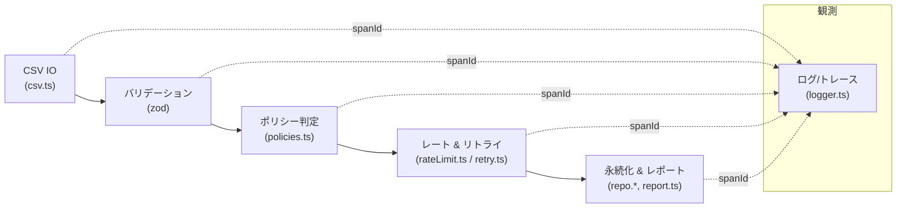

# TypeScript Neverthrow データ取込パイプライン

TypeScript と neverthrow を用いた、運用志向の CSV 取込パイプラインの最小実装です。宣言的なパイプライン構成、厳格なバリデーション、リトライ/レート制御、冪等な永続化、構造化ログを組み合わせています。



## 特長

- ストリーミング CSV リーダー（`readCsv`）によりメモリを枯渇させずに `RawUser` を逐次生成。
- Zod による正規化と neverthrow でのエラー写像で、入力境界を完全型安全化。
- ポリシーレイヤが重複排除・遅延更新防止・捨てアドレス遮断を担い、失敗時は `PolicyError` を返却。
- `p-limit` と指数バックオフ＋ジッタ付きリトライで永続化を保護し、再実行でも冪等。
- span ID 付きの構造化ログを Pino で出力し、バリデーション失敗やリトライを可観測化。
- レポートは取込件数、勝ち負け内訳、ドメイン分布、失敗サマリを表示。
- Vitest によるバリデーション境界・リトライ制御・冪等性・E2E のテストを同梱。

## プロジェクト構成

- `src/app/`: パイプライン合成、レポート、エラー定義。
- `src/domain/`: ドメイン型、Zod スキーマ、ポリシー判定。
- `src/infra/`: ロガー、レート制御、リトライ、リポジトリなどのインフラ層。
- `src/utils/`: CSV パーサや Result ユーティリティなどの共有処理。
- `test/`: Vitest テスト（`*.unit.test.ts` / `*.int.test.ts`）。
- `src/types/env.d.ts`: 環境変数の型補強。

## セットアップ

```bash
pnpm install
pnpm test
pnpm start -- --source samples/users.csv --idempotency batch-20240501
```

CLI は標準入力を既定ソースとします。`cat users.csv | pnpm start -- --source -` のようにパイプ可能です。

## ビルド & 開発コマンド

- `pnpm build` — `tsc` で `dist/` にコンパイル。
- `pnpm test` — Vitest を一括実行。
- `pnpm start -- --source <path|- >` — CSV 取込パイプラインを CLI 起動。

## コンフィグ

`.env`（`.env.example` を参照）に設定を記述し、`src/config.ts` が zod で検証した上で読み込みます。

- `CONCURRENCY`：永続化の最大並列数（例: `4`）。
- `FAIL_FAST`：最初のバリデーション/ポリシー失敗で停止するか。
- `RETRY_*`：指数バックオフの各種パラメータ。
- `IDEMPOTENCY_TTL_MS`：冪等性キャッシュの保持期間。
- `BULK_FAIL_FAST`：バルク upsert 中に失敗したら即座に打ち切るか。
- `LOG_LEVEL`：Pino のログレベル（`info`/`debug`/`silent` など）。

不正設定は `ConfigError` を返し、処理開始前に失敗を明示します。

## コーディング規約

- TypeScript `strict` モードが標準。`if`/`for`/`try` に頼らず、neverthrow の `Result` / `ResultAsync` を使った式ベースの分岐を徹底します。
- 構造は `type` エイリアスで表現し、関数・変数は `camelCase`、型は `PascalCase` を使用。
- Pino ログには `spanId` を含め、トレース性を確保します。

## 運用メモ

- **可観測性**：パイプライン実行ごとに span ID 付きログを出力。バリデーション失敗件数・ポリシースキップ・リトライ履歴を確認可能。
- **SLO と終了コード**：完全成功は `0`、非致命エラー集約は `2`、致命失敗は `1`。ワークフローや警告トリガーに割り当てやすい構成です。
- **リプレイ/冪等性**：同じ `--idempotency` キーで再投入しても二重書き込みを防止。下流障害からの再実行に安全。
- **スロットリング**：`p-limit` と指数バックオフでバックエンドを保護。SLA に合わせて並列数と遅延を調整してください。

## テスト

`pnpm test` で全テストを実行できます。主な検証内容：

- バリデーション：メール形式・年齢レンジ・日時パースの境界。
- リトライ：初回失敗→成功、最大試行到達時の挙動。
- リポジトリ：同一 idempotency キーでの再投入時にもレコードが増えない。
- 結合テスト：CSV 取込からレポート出力まで。

## コントリビューションの流れ

- コミットメッセージは命令形（例: `Add policy handler map`）で、一貫した粒度でまとめてください。
- Pull Request には変更概要、目的、`pnpm test` の結果、設定・CI 変更の有無を記載。
- 関連 Issue をリンクし、CLI 出力やログ形式を変更した場合はスクリーンショットやログ抜粋を添付。
- 新しい環境変数を導入する際は `.env.example` と `src/env.ts` / `src/config.ts` を更新してください。

## 拡張ポイント

- `UserRepository` インタフェースを実 DB/外部サービス実装に差し替え。
- ポリシー判定を設定ファイルやフィーチャーフラグ連携で柔軟化。
- リトライ中に OpenTelemetry/Prometheus メトリクスを発行。
- S3 や HTTP など別ソースから CSV を取得するストリームラッパーを実装。

## 運用チェックリスト

1. ロードテスト中は `LOG_LEVEL=debug` でリトライ動作を追跡。
2. 冪等性 TTL を調整し、キャッシュサイズと再実行ウィンドウのバランスを確保。
3. 捨てアドレスドメインリストを定期更新し、ポリシーの正確性を維持。
